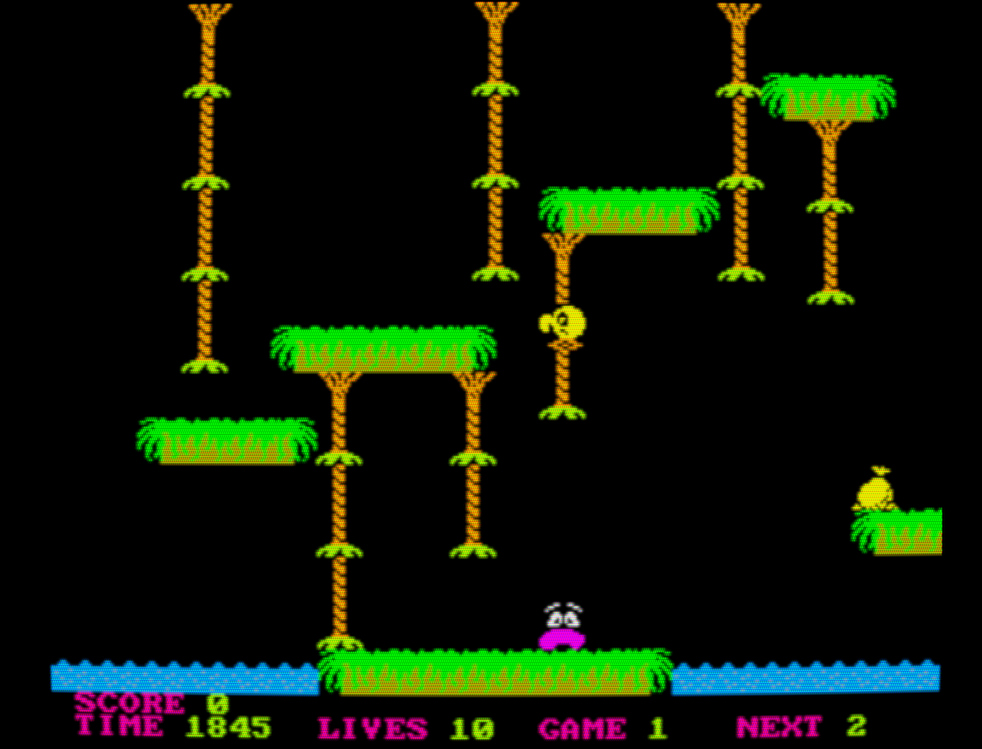
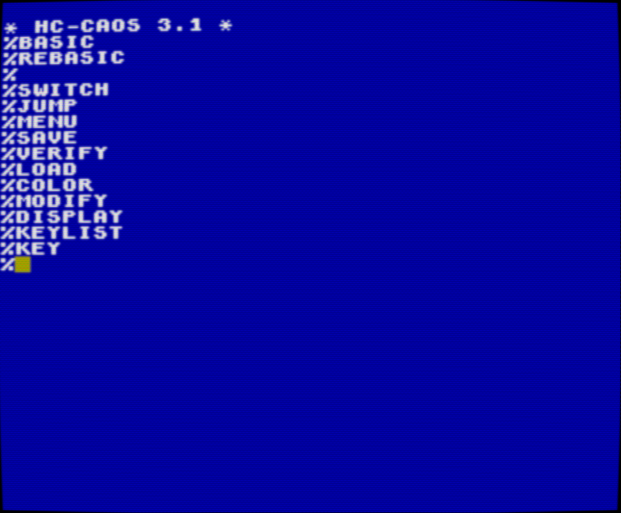

# YAKC (Yet Another KC Emulator)

[](https://travis-ci.org/floooh/yakc)

Despite the name this is a multi-system emulator for 8-bit home computers.

It started as a KC85 emulator because this was the system I spent most of
my youth on: https://en.wikipedia.org/wiki/KC_85

## Live Demo

http://floooh.github.io/virtualkc/

This is a WebAssembly version. If this doesn't work, switch to the
asm.js version through the top-left hamburger icon.

## How to Build:

```bash
> python --version
Python 2.7.10
> cmake --version
cmake version 3.3.2
> git clone https://github.com/floooh/yakc
> cd yakc
> ./fips build
> ./fips run yakcapp
```

In debug mode, the emulator tries to load additional ROMs and games
from a local HTTP server at port 8000. Just do this:

```bash
> cd yakc/files
> python -m SimpleHTTPServer
...
```

And run the emulator from another terminal window. When building in
release mode, the emulator will load the data directly from the
webpage at http://floooh.github.io/virtualkc/

# Overview

YAKC currently emulates the following 8-bit systems:

- KC85/2, KC85/3, KC85/4, KC Compact (VEB Mikroelektronik Muehlhausen)
- Z9001 (aka KC85/1) and KC87 (Robotron Dresden)
- Z1013 (Robotron Riesa)
- Sinclair ZX Spectrum 48k and 128k
- Amstrad CPC464 and CPC6128
- Acorn Atom

Source code of the system emulators is here: https://github.com/floooh/yakc/tree/master/src/yakc/systems

The system emulators are built on top of dependency-free,
header-only chip emulators written in C (https://github.com/floooh/chips).

Rendering and input is done through Oryol: https://github.com/floooh/oryol

Audio is done through SoLoud: https://github.com/jarikomppa/soloud

The extensive debugging UI is implemented with Dear Imgui: https://github.com/ocornut/imgui

Kudos to MAME for providing a reference when there was insufficient 
documentation available for emulated chips and computer systems: https://github.com/mamedev/mame

The following platforms are fully supported:

- asm.js / wasm
- OSX
- Windows
- Linux

The emulator should also build and run on Android, iOS and Raspberry Pi but
this is less tested and there will be input- or performance-problems on those
platforms.

# Implementation Details

A few implementation details are worth mentioning:

- on M6502 machines (currently only the Acorn Atom), the system
is ticked per clock cycle and fully implements the M6502 memory
access quirks (each cycle is a memory access, including 'junk accesses')
- on Z80 machines, the system is ticked with machine-cycle granularity
(typical 3..5 clock cycles, or more if wait states are injected)
- all known undocumented Z80 behaviour is implemented, the M6502 implements
the 'stable' undocumented instructions, but not most of the 'unstable'
instructions
- communication between chips happens (mostly) with pin bit masks instead of
specialized callbacks, this means the system emulation source code mimics how
the different chips are connected on the motherboard instead of relying on
'high level recipes' which describe the functions of specific I/O addresses

# Emulated System Details

All the East German computer models had 'unlicensed' Z80-chip-family clones
called U880 (Z80 CPU), U855 (Z80 PIO) and U857 (Z80 CTC). The East German
clones had some hardware bugfixes compared to the original Z80 and thus some
undocumented instructions behaved slightly different. YAKC emulates the
original Z80, not the 'fixed' U880 clones (doesn't make a difference with all
software I tested).

## KC85/2, KC85/3 and KC85/4

These were East German home computers with fairly impressive hardware- and
software-capabilities, at least given the 'real-world-socialist' economic
restrictions of 80's Eastern Germany. Unlike many other Eastern computers,
the KC85 line wasn't a direct clone of Western machines, but implemented some
unique ideas both in hardware and software. In terms of hardware
capabilities, the ZX Spectrum was the closest Western system, the KC85 had a
slower CPU, but higher-resolution graphics.

- manufactured by VEB Mikroelektronikkombinat Muehlhausen from 1985 (KC85/2)
to 1989 (KC85/4)
- Z80 CPU @ 1.75 MHz, Z80 PIO and Z80 CTC
- 320x256 display resolution with 16 foreground and 8 background colors
- 8x4 pixels or 8x1 pixels color attribute resolution (same idea as the
ZX Spectrum but with smaller color attribute blocks)
- 16 KByte (KC85/2 and /3) to ~128 KB RAM (KC85/4)
- 8 KByte to 20 KByte ROM (operating system and BASIC)
- no hardware sprites, programmable video signal generator or 
dedicated sound chip

A few KC85 games:

Digger:


A Pengo 'clone':


Cave:


House:


Jungle:


KC85/3 start screen with operating system HC-CAOS 3.1:



## Z9001 and KC87

This was another of the 'big three' East German 8-bit computer models,
built by Robotron Dresden. The Z9001 was later renamed to KC85/1 even
though it had no similarities with the KC85/2-based computers from
Muehlhausen. The KC87 is identical to the Z9001 apart from a builtin
BASIC. A color graphics module was optional (YAKC implements monochrome
graphics for the Z9001 and color graphics for the KC87).

- manufactured by Robotron Dresden from 1984 (Z9001) and 1987 (KC87)
- Z80 CPU @ 2.5 MHz, 2(!) Z80 PIOs and a Z80 CTC
- 16 KByte RAM
- 4 KByte ROM, and additionally a 10 KByte ROM BASIC in the KC87
- 40x24 or 40x20 black-and-white or 8-color character graphics

KC87 running BASIC:


## Z1013

The Z1013 is the last and most simple of the East German computers 
emulated by YAKC. It was mostly a hobbyist computer sold as kit, 
and the only computer in Eastern Germany that was sold directly
to citizens.

- manufactured by Robotron Riesa from 1985
- Z80 CPU @ 2.0 MHz, Z80 PIO
- 16..64 KByte RAM
- 2 KByte ROM
- 32x32 monochrome character graphics

A Z1013 running a clone of the ZX81 game Mazogs:


## ZX Spectrum 48k and 128k

The ZX Spectrum was a British machine which was also
popular as self-built hobbyist machine or official clone in
the Eastern hemisphere because of its simple hardware architecture.

- manufactured by Sinclair from 1982
- 3.5 MHz Z80 CPU, custom 'ULA' chip, AY-3-8912 sound chip in the 128k
- 256x192 @ 15 colors in 8x8 color attribute blocks

YAKC currently doesn't emulate the 'contended memory' performance
penalty when accessing video memory.

The iconic 128k start screen:


The 48k version of Bomb Jack:


Exolon on the 48k:


The start screen of Arkanoid RoD on the 128k:


## Amstrad CPC 646, 6128 and KC Compact

The Amstrad CPC had a very interesting architecture which is
surprisingly tricky to emulate. Even though the video system
lacked hardware sprites, it made up for it by making clever use
of the fairly programmable MC6845 video signal generator chip,
which allow some graphics effects otherwise only known from the
much more powerful Amiga.

The KC Compact is an outlier, it was an East German CPC clone
produced from 1989, and cancelled soon after the Wall came down.
The KC Compact emulated the custom Amstrad gate array chip with
standard TTL logic, YAKC is cheating here a bit and treats all
CPC models the same (the only difference of the KC Compact is
a slightly different color palette, and different ROMs).

- manufactured by Amstrad, Schneider, MEK Muehlhausen and others from 1984
- 4 MHz Z80 CPU (real world perf more like 3.3 Mhz because of wait state injection)
- 64 or 128 KByte RAM
- 32 KByte ROM
- i8255 Programmable Peripheral Interface chip
- MC6845 CRT Controller chip
- AY-3-8912 Programmable Sound Generator chip
- Amstrad 40007/40010 custom gate array chip
- 27 hardware colors (32 with some redundant colors)
- 160x200 @ 16 colors, 320x200 @ 4 colors or 640x200 @ 2 colors display modes

The Amstrad 6128 start screen:


The DTC demo by Arkos and Overlanders:


The CPC version of Bomb Jack:


Arkanoid on the CPC:


Cybernoid:


## Acorn Atom

The Atom is one of the early Acorn 8-bit computers with a very simple but
clever architecture (especially for its early release date). Apart from the 
Netherlands it wasn't very popular in continental Europe. Currently this is
the only system in YAKC with a MOS 6502 CPU.

- manufactured by Acorn from 1980
- 1 MHz MOS Technology 6502 CPU
- up to 40 KByte RAM
- up to 16 KByte ROM
- MC6847 Video Display Generator chip
- i8255 Programmable Peripheral Interface chip
- optional 6522 Versatile Interface Adapter chip
- mixed text/semigraphics 32x16 display mode
- various graphics display modes from 64x64 @ 4 colors up to 256x192 @ 2 colors

Acorn Atom mixed text/semigraphics mode:


The game 'Atomic Chucky Egg':


# The Debugger UI

YAKC has an extensive debugging UI implemented with Dear Imgui:

