## Exploring CAOS

This is a little tour through CAOS, the operating system of the KC85 computers 
(CAOS means Cassette-Aided-Operating-System).

First, boot into the latest official CAOS version 4.2 from 1989 (toggle the
debugging UI overlay by pressing the **Tab** key):

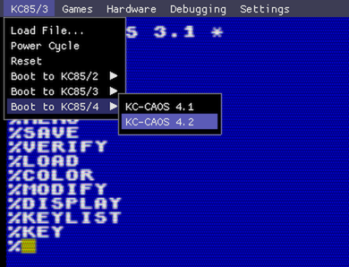

After about two seconds (yep, those little 8-bitters booted really fast),
CAOS is displaying a list of available commands and is ready to accept input:

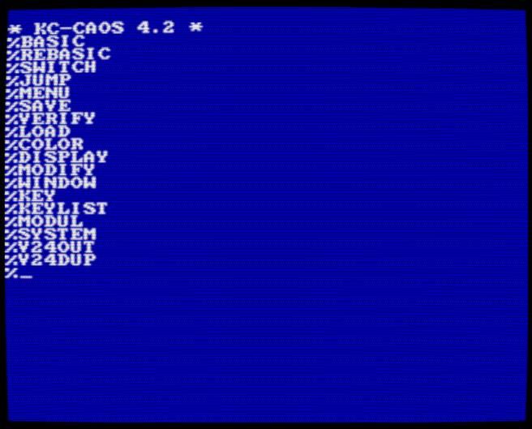

You can move the cursor freely around the screen using the **[Arrow-keys]**.

**[Enter]** tries to parse whatever is on the current line as a command.

**[Shift-Backspace]** clears the screen.

The command **MENU** rebuilds the list of available commands.

### Color and window management

The **COLOR** command changes the foreground and background color, there
are 15 foreground colors and 8 background colors to choose from. Note that
all numbers are expected as hexadecimal. This is true for all CAOS commands:

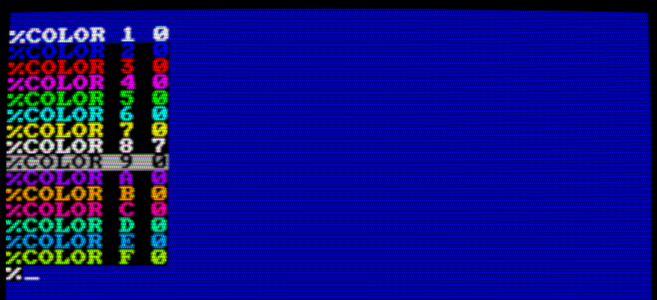

The **WINDOW** command defines a rectangular window and assigns it an id,
basically a very simple tmux-like terminal-session-manager. The WINDOW command 
takes 5 parameters that define the window rectangle and a window id:

~~~
WINDOW y h x w id
~~~

Where 'x' and 'y' are the coordinates of the top-left corner, and 'w' and
'h' are the window width and height. The max width of a window is 28 hex, and
the max height is 20 hex. The 'id' is a number between
0 and 9. Once windows are defined, they can be activated with 

~~~
WINDOW id
~~~

The following commands split the screen in half into two windows with 
different background colors (if you screw up, simply Reset the KC85/4 
using the debugger menu).

~~~
[first press Shift-Backspace to clear the screen]
[then press Enter to get a prompt]

%WINDOW 10 10 0 28 1
%COLOR 0 6
[Shift-Backspace plus Enter to clear the new window]
%WINDOW 0 10 0 28 2
%COLOR 0 4
[Shift-Backspace plus Enter to clear the second window]
~~~

There should be 2 independent windows now which can be toggled with
the commands **WINDOW 1** and **WINDOW 2**:

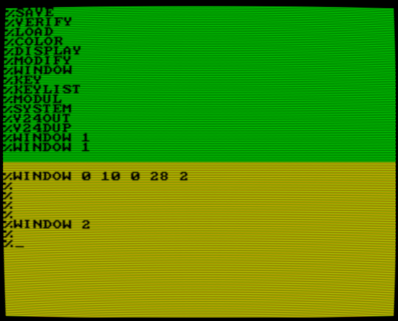

### Assigning function keys

Typing **WINDOW 1** and **WINDOW 2** to switch between windows is tedious,
lets assign these commands to F1 and F2:

~~~
%KEY 1
WINDOW 1[Enter][Shift-Escape]
%KEY 2
WINDOW 2[Enter][Shift-Escape]
~~~

It should look like this:

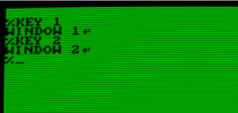

Pressing **F1** and **F2** will now switch between the 2 windows.

The command **KEYLIST** shows all current function key assignments:

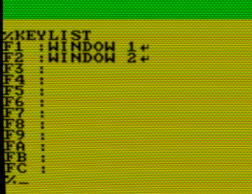

Switch back to the original window by typing **WINDOW** without any
arguments, then type **MENU** to get the list of commands.

### Viewing and editing memory contents

The command **DISPLAY** shows a hex-dump of the memory starting 
at **aaaa** with **ss** number of lines at a time and **n** columns:

~~~
DISPLAY aaaa [ss [n]]
~~~

For instance, to show the start of the pixel video memory:

~~~
%DISPLAY 8000 4
...
[Escape]
~~~

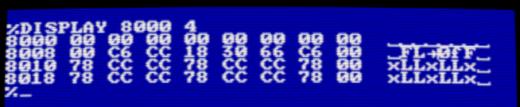

The DISPLAY command will wait for keyboard input. Hit [Escape] to 
go back to the command prompt.

The **MODIFY** command implements a simple hex-editor. Let's mess up some video
memory starting at address 8000: Type **MODIFY 8000**, and enter some
hex-numbers, then press [Enter]. Enter a **dot** to go back to the command
prompt:

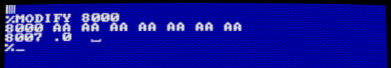

### Memory banks, expansion slots and modules

The commands **SYSTEM**, **MODUL**, **JUMP** and **SWITCH** control the
hardware expansion system. Each KC85 has 2 expansion slots numbered **08** and 
**0C**. Additional 'bus-driver' devices with 4 more expansion slots could
be stacked on top of the base device.

The command **SYSTEM** gives an overview of the built-in memory banks:

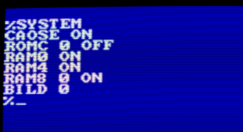

This means:

~~~
CAOSE ON:   the operating system ROM at address E000 is switched on
ROMC 0 OFF: both ROM banks at address C000 are switched off
RAM0 ON:    the built-in RAM at address 0000 is switched on
RAM4 ON:    the built-in RAM at address 4000 is switched on
RAM8 0 ON:  the first of the 2 RAM banks at address 8000 is switched on
BILD 0:     the first video memory area (out of 2) is displayed
~~~

The **SWITCH** command is used to control built-in memory banks and
expansion modules:

~~~
SWITCH mm kk
~~~

**mm** is the module slot or memory bank id, and **kk** is a control byte.

The following ids are used for the built-in memory banks and the
expansion slots of the base device:

~~~
RAM at address 0000:      mm = 00
video memory:             mm = 01
ROM banks:                mm = 02
RAM at address 8000:      mm = 03
RAM at address 4000:      mm = 04
right expansion slot:     mm = 08
left expansion slot:      mm = 0C
~~~

**kk** encodes the on/off state (bit 0), write protection (bit 1) and starting
address (bits 4..7).

For instance to switch off the memory bank at address 4000:

~~~
%SWITCH 04 00
~~~

The **SYSTEM** command, and **DISPLAY**ing the memory at address 4000 confirm
that the memory is no longer mapped:

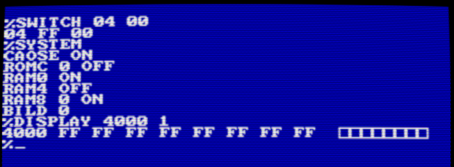

Switch it back on with:

~~~
%SWITCH 04 43
~~~

The SWITCH command is also used to control modules in expansion slots.

Insert the FORTH expansion module into slot 08 using the debugging UI 
(on a real KC85, you must only do this when the device is powered down!):

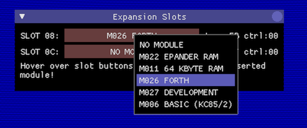

The FORTH module is now in expansion slot 08, as can be seen with the **MODUL**
command, but it is not switched-on yet. To function properly, the 
module must be switched to address C000, this is achieved with the
command **SWITCH 08 C1** (08 means 'expansion slot 08', the 'C' in C1 means 
'at address C000, and the '1' in C1 means: 'active'). Another MODUL
command confirms that the modul in slot 08 has the new control byte C1
(the **FB** is the module hardware identifier):

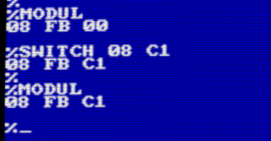

When displaying the **MENU** again, there are now 2 new commands called
**FORTH** and **REFORTH** (at least when you're on the KC85/4):

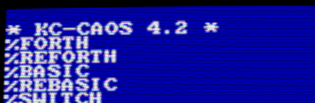

If you're *not* seeing the two new menu entries, you're on a KC85/3, where
the BASIC ROM is blocking access to the FORTH module. In this case,
the BASIC ROM must be switched off first with **SWITCH 02 00**.

To give it a try, type **FORTH**, when done, return to the CAOS command
prompt with **BYE**:

The remaining module management command **JUMP** is used to jump into
an alternative operating system provided in a ROM module. In the emulator, 
this is currently only useful with the M006 BASIC ROM module for the KC85/2.
How this works is left as an excersice to the reader ;)

### Cassette loading/saving, and V24 control

Before you get excited, all the remaining commands don't do anything
useful in the emulator.

On a real KC85, the commands **LOAD**, **SAVE** and **VERIFY** are used
to load and save data from and to cassettes, and verify a saved file.

In the emulator, LOAD and VERIFY will simply wait forever. For shitz'n'giggles 
you can try to save some data (make sure you have sound enabled):

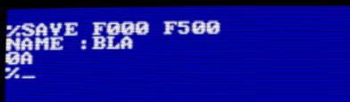

It sounds cool, but the sound emulation isn't precise enough that the
save audio signal would be any useful.

The 2 remaining commands, **V24OUT** and **V24DUP** were used to control
the V24-interface module. V.24 was (is?) a serial interface standard used 
to communicate between machines, modems and printers.

